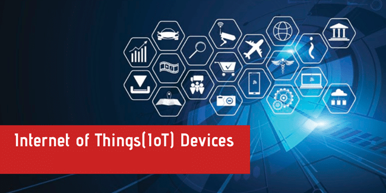

# Introduction to Internet of Things

Most of the materials in this page comes from the internet.

********************

## Definition

The Internet of Things (IoT) describes the network of physical objects ¡ª ¡°things¡± ¡ª 
that are embedded with sensors, software, and other technologies for the purpose 
of connecting and exchanging data with other devices and systems over the internet. 
These devices range from ordinary household objects to sophisticated industrial 
tools. Experts are expecting IoT devices number to grow to 22 billion by 2025, 
and to reach more than a trillion devices by 2035. 

## Description

The Internet of Things is transforming our physical world into a complex and 
dynamic system of connected devices on an unprecedented scale.

Advances in technology are making possible a more widespread adoption of IoT, 
from pill-shaped micro-cameras that can pinpoint thousands of images within the 
body, to smart sensors that can assess crop conditions on a farm, to the smart 
home devices that are becoming increasingly popular. But what are the building 
blocks of IoT? And what are the underlying technologies that drive the IoT 
revolution?

Internet of Things (IoT) origin, vision and definition. 
Application domains, use case scenarios and value propositions. 

Functional blocks of IoT systems: 
* devices
* communications
* services
* management
* security
* and application. 

Architectural reference model and design methodology. 

IoT Devices: sensors, actuators and embedded systems. 

Communications aspects of IoT systems: 
* Internet infrastructure
* wireless local area networks; 
* radio access networks
* wireless personal area networks
* wireless sensor networks
* wireless communication in vehicular environments
* 5G 

Current IoT frameworks and underlying architectures. 
Data storage and analytics. 
Web services. 
IoT system management tools. 
Security aspects of IoT systems. 
Open issues.

## Top IoT Companies to Watch Out in 2021 

IoT has made complete automation possible. The solutions like Smart cities, 
Smart Home, Smart Factory, and Connected Vehicle are possible only because of IoT.

IoT has differently shaped traditional industries. It is based on ICT (Information 
and Communication Technology). It has combined both the physical and digital 
worlds together.

This technology will indeed help in streamlining business processes and thereby 
boost productivity to a great extent. It will give the manufacturing industry 
the ability to provide better products and services.

IoT can be understood by taking a simple Example of Smart Home. IoT made it 
possible to make the homes Smart homes where even the lights can be switched on 
or off using the smartphones. 

The devices which we have never imagined with the internet, are now connected 
to the internet and that is IoT. It has given the power to objects to 
communicate without any human intervention.

The image given below will show you the spending of IoT worldwide and thereby 
depict the growth of IoT.

### List Of The Best Internet Of Things Companies

Enlisted below are some of the most popular IoT Software Solutions and 
Services Companies worldwide.

1. Softeq (Houston, Texas, USA)
2. Oxagile (New York, US)
3. Style Lab IoT Software Company (San Francisco, CA)
4. HQ Software Industrial IoT Company (USA & Europe)
5. PTC (Boston, Massachusetts)
6. Cisco (San Jose, CA)
7. ARM IoT Security Company (Cambridge, Cambs)
8. Huawei (Shenzhen, Guangdong)
9. GE Digital (San Ramon, California)
10. Bosch IoT Sensor Company (Farmington Hills, MI)
11. ScienceSoft (USA & Europe)
12. SAP (Walldorf, Germany)
13. Siemens IoT Analytics Company (Berlin and Munich, Germany)
14. IBM (New York, U.S.)

R-Style Lab and HQ Software provide IoT solutions like Smart Home, Industrial 
IoT, and Healthcare IoT. Cisco has many IoT solutions like IoT security, IoT 
Networking, etc.

ARM is good for processors. It provides an IoT solution for connectivity 
management, device management, and data management. Huawei provides multiple 
solutions for IoT like smart water solutions and smoke detection. PTC and GE 
Digital provide an IoT platform.

Bosch¡¯s IoT Suite is an open IoT platform for all business domains. MindSphere 
is an Open IoT OS by Siemens. Watson IoT is a popular IoT solution by IBM.

## IoT Devices

IoT devices support the expansion of internet connection beyond the usual 
standard devices like computers, laptops, smartphones etc.

The IoT devices are purely integrated with high definition technology which 
makes it possible for them to communicate or interact over the internet smoothly 
and can also be managed and controlled remotely when required.

It is a matter of fact today that a number of IoT products have surpassed a 
huge number of humans on this planet.

Approximately there are around 7.62 billion humans on our planet, but to your 
surprise, by the year 2021 with an increasing graph of IoT devices, there may 
be around 20 billion IoT smart devices up and running with an increase in the 
demand of 5g network.

Please refer the below graph for to know the increasing demand for these devices 
in the near future:

If an average is made then after some years each and every individual in 
America would be having more than 10 IoT devices of their own. Please refer 
this [post](https://www.mediapost.com/publications/article/302663/north-american-consumers-to-have-13-connected-devi.html) 
to more about this statistical data.

Nowadays, the production and usage of the Internet of Things devices are 
increasing very rapidly. IoT products and devices basically include laptops, 
smartphones, smart gadgets, smart watches, smart and digitalized vehicles and 
almost all of these are used majorly today.

How does IoT work and what does makes them smart device?

It basically depends on two things to transform a normal device into IoT smart 
device.

**They are:**

1. The device which has the capability to connect with the internet in any way.
2. The device which is integrated with technology like sensors, functional 
software, some inbuilt technology which support network connections and also 
actuators.

When both these functionalities are combined together an IoT device is formed. 
Earlier only simple watches were only used to see the time and date, but now 
the smart IoT watches allow a user to see heartbeat rate, calorie count, steps 
walked etc.

The market for IoT devices is expanding rapidly day by day and becoming more 
popular as well with the drastic increase in the number of users who use them 
daily.

IoT Life Cycle
IoT has a very simple lifecycle of development.

Deployment followed by monitoring, servicing, managing, which is followed by regular updates and decommissioning at the end.

IoT Product Lifecycle is described in the below diagram.

Advantages Of IoT Devices
There are several advantages of these smart devices and some of them are given below.

IoT encourages the interaction between devices called as a machine to machine interaction.
It provides good automation and control.
Integrated with more technical information, so it is better to operate.
IoT possesses strong monitoring feature.
It saves a lot of time.
IoT helps to save more money by reducing manual task and time.
Automating daily life tasks makes good monitoring of devices.
Increased efficiency and time-saving.
With good features make a better quality of life.
Disadvantages
Though there are several advantages, there are certain disadvantages too.

Enlisted below are the various demerits:

Internet of Things devices does not have any international compatibility standard.
They may become highly complex resulting in failure.
Internet of Things devices may get affected by privacy and security breach.
Reduced safety for users.
Reduction in the employment of manual tasks thus resulting in job reductions.
Internet of Things device may take control of life in due course of time with increasing AI technology.
Frequently Asked Questions For The Internet Of Things Devices
Some of the Frequently Asked Questions for the Internet of Things devices are enlisted below for your reference:

#1) What are IoT devices?

Answer: IoT devices are basically smart devices which have support for internet connectivity and are able to interact with the other devices over the internet and grant remote access to a user for managing the device as per their need.

#2) What are the examples of IoT devices?

Answer: There are several top devices in the market. Smart Mobiles, smart refrigerators, smart watches, smart fire alarm, smart door lock, smart bicycle, medical sensors, fitness trackers, smart security system etc., are few examples of IoT products.

#3) How many IoT smart devices may be there by the year 2021?

Answer: IoT device market is increasing drastically, hence it is assumed to have more than 20 billion IoT products in the market up and in running state by the year 2021.

#4) What technologies are used in IoT products?

Answer: The technologies used in these devices are low energy wireless and Bluetooth, NFC, LTE, ZigBee, wireless protocols etc.

#5) What exactly is the use of an IoT product/device?

Answer: IoT product/devices are basically physical devices integrated with software and can connect with each other over the internet to exchange information, they help the user for more simple and direct integration of the physical world.

Note: The information provided in this article is purely based on the information available on the internet and not from any private source.

## IoT Devices Examples

### 1 XIAOMI xiaoAI Home Voice Controller

XiaoAI Home Voice Controller is a smart IoT device which allows the user to 
enjoy features like media, alarms, lights, thermostats, control the volume and 
much more functions just by their voice.

Cost: US $ 100

Top Features:
* allows a user to listen to media.
* Let¡¯s the user to control TV and speakers.
* It is capable of managing timers and alarms.
* It can remotely handle the volume and home lights as well.
* It helps the user to plan their day and get things done automatically.
 
Company Website: [xiaoAI Voice Controller](https://www.mi.com/aispeaker-hd)

**Conclusion**

Internet of Things IoT device is a burning topic in the current era. We 
understood how these smart devices developed by mankind for mankind are 
impacting in both positive and negative ways.

In this subsection, we came to know about IoT device which is the Internet of 
Things, the types of devices which include IoT in our day to day life and the 
process in which the IoT devices make a user¡¯s task simple and quick.

We saw how this technology which is increasing drastically is going to impact 
the future of mankind and the working principle of IoT devices. You also came 
to know about the price, features, video explanation and from where to buy 
these devices as per your requirements.

With these points, we believe the time is not too far, in which we will see each 
and every individual, home using and depending on these ¡°Internet of Things¡±.

